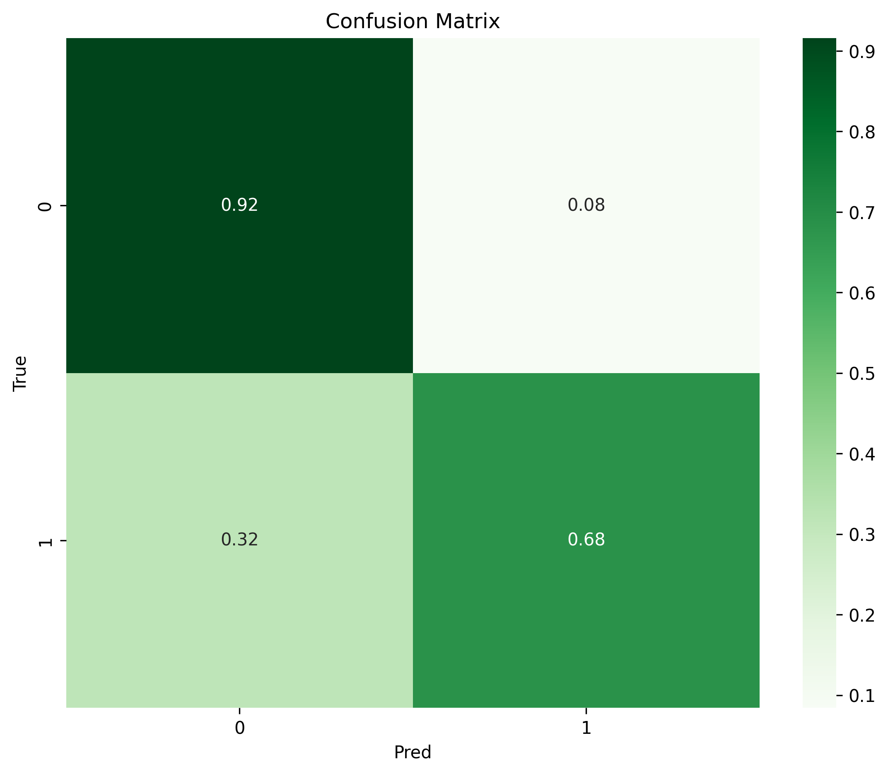
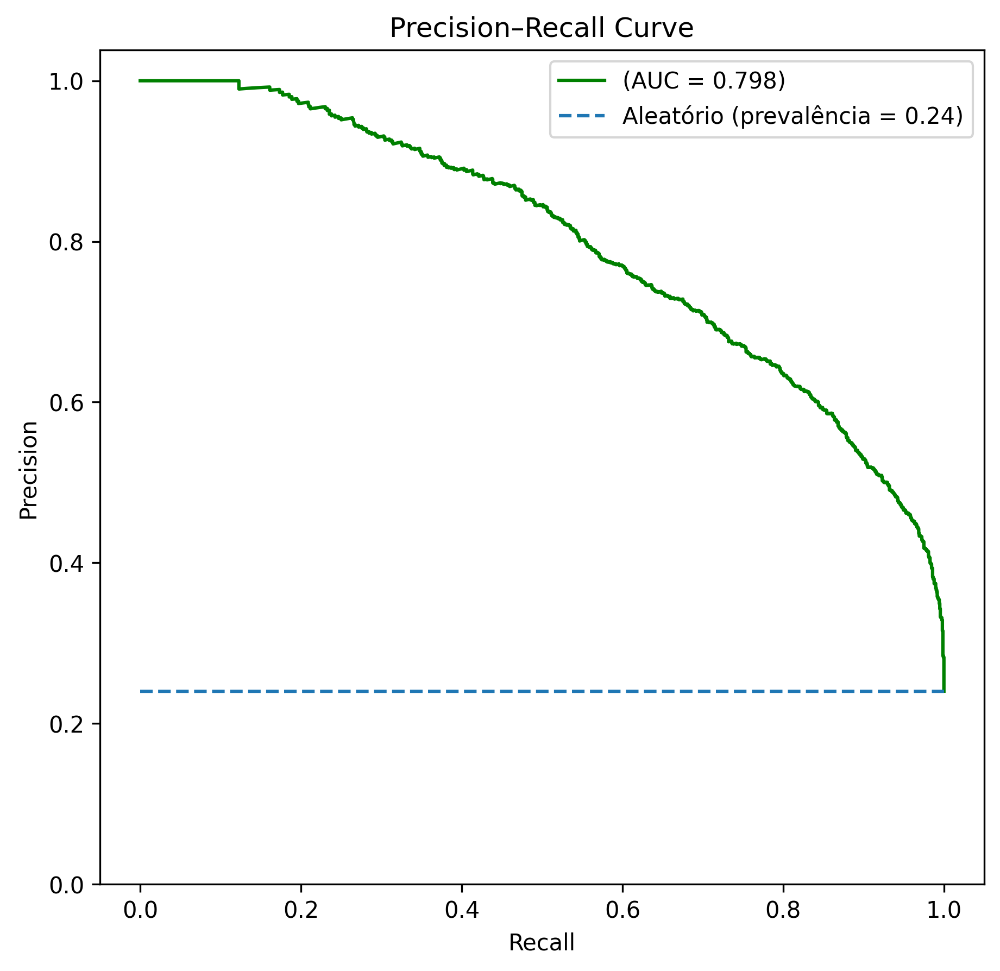

<a name="readme-top"></a>

[![Contributors][contributors-shield]][contributors-url]
[![Forks][forks-shield]][forks-url]
[![Stargazers][stars-shield]][stars-url]
[![Issues][issues-shield]][issues-url]
[![MIT License][license-shield]][license-url]
[![LinkedIn][linkedin-shield]][linkedin-url]

<br />
<div align="center">
    <a href="https://github.com/felmateos/income-analysis">
        
    </a>
  <h3 align="center">Predição de Renda por Atributos Demográficos</h3>

  <p align="center">
    Pipeline de predição de renda construído usando o framework Kedro
    <br />
    <br />
    <a href="https://github.com/felmateos/income-analysis/issues">Report Bug</a>
    ·
    <a href="https://github.com/felmateos/income-analysis/issues">Request Feature</a>
  </p>
</div>

---

## 📌 Contexto Geral

Este projeto tem como objetivo desenvolver um pipeline de ciência de dados para **predição de renda anual de indivíduos**, a partir de atributos demográficos, educacionais e ocupacionais. O problema é formulado como uma **classificação binária**, em que o modelo estima se a renda anual de uma pessoa é **superior ou inferior a US$ 50.000**.

Além do desempenho preditivo, o foco central do estudo está na **análise dos fatores associados à renda**, buscando identificar padrões socioeconômicos relevantes e compreender como diferentes variáveis influenciam a probabilidade de um indivíduo pertencer à classe de maior renda. Todo o fluxo foi estruturado utilizando o **Kedro**, garantindo organização, reprodutibilidade e separação clara entre dados, experimentos e resultados.

<div align="center">
    
</div>

---

## 🗃️ Hierarquia do Projeto

```bash
income-analysis/
├── conf/
│   └── base/
│       ├── catalog.yml
│       └── parameters.yml
├── data/
│   ├── 01_raw/
│   ├── 02_intermediate/
│   ├── 03_split/
│   ├── 04_preprocessor/
│   ├── 05_model_input/
│   ├── 06_models/
│   └── 07_model_output/
├── images/
│   ├── confusion_matrix.png
│   ├── income_logo.png
│   ├── money_angel.png
│   └── pr_curve.png
├── notebooks/
│   └── income_analysis.ipynb
├── src/
│   ├── pipeline_registry.py
│   ├── settings.py
│   └── income_kedro/
│       └── pipelines/
│           └── income/
│                ├── nodes.py
│                └── pipeline.py
├── LICENSE
├── pyproject.toml
├── README.md
└── requirements.txt
```

## ⚡ Conjunto de Dados

O experimento utiliza o **Adult Income Dataset**, disponibilizado originalmente pelo UCI Machine Learning Repository. O conjunto de dados contém informações demográficas e socioeconômicas de indivíduos, como idade, nível educacional, ocupação, estado civil, país de origem e ganhos de capital.

A variável alvo indica se a renda anual do indivíduo é **maior que US$ 50.000** ou não, sendo amplamente utilizada como benchmark em problemas de classificação supervisionada. O dataset apresenta desafios comuns do mundo real, como **desbalanceamento de classes**, variáveis categóricas de alta cardinalidade e possíveis vieses socioeconômicos.

---

## ⚙️ Projeto do Experimento

### Pré-processamento

A etapa de pré-processamento envolve a limpeza e padronização dos dados, incluindo o tratamento de valores ausentes, normalização de categorias textuais (como países de origem) e codificação de variáveis categóricas. Também é realizada a separação entre conjuntos de treino e teste, garantindo uma avaliação adequada do desempenho do modelo.

### Modelagem

O problema é tratado como uma tarefa de **classificação binária**, com experimentos envolvendo modelos de Machine Learning supervisionado. O foco está em encontrar um bom equilíbrio entre desempenho preditivo e interpretabilidade, permitindo analisar a importância das variáveis e compreender os fatores que influenciam as decisões do modelo.

<p align="right">(<a href="#readme-top">back to top</a>)</p>

---

## 📊 Resultados e Avaliação

Os modelos foram avaliados utilizando métricas adequadas para cenários com **desbalanceamento de classes**, com destaque para Precision, Recall e F1-score, além da análise da curva Precision-Recall. Essas métricas permitem avaliar melhor o desempenho na classe positiva, que é a de maior interesse no contexto do problema.

---

## 📊 Matriz de Confusão

A matriz de confusão permite visualizar a distribuição de acertos e erros do modelo, evidenciando a relação entre previsões corretas e incorretas para cada classe. Essa análise auxilia na compreensão dos trade-offs entre falsos positivos e falsos negativos.

<div align="center">
  
</div>

---

## 📉 PR-Curve

A curva Precision-Recall é utilizada como principal ferramenta de avaliação, pois fornece uma visão mais informativa do desempenho do modelo em cenários com classes desbalanceadas. Ela destaca como a precisão varia em função do recall para diferentes limiares de decisão.

<div align="center">
  
</div>

---

## 🔎 Análise dos Resultados

A análise dos resultados indica que variáveis como **ganho de capital declarado**, **nível educacional elevado** (Bachelor, Master, Doctorate ou Professional School) e **estado civil casado** estão associadas a uma maior probabilidade de o indivíduo pertencer à classe de renda acima de US$ 50.000.

Por outro lado, indivíduos com **menor grau de escolaridade**, ocupações ligadas a **serviços domésticos** e origem em determinados países latino-americanos apresentam maior associação com a classe de menor renda. Esses resultados levantam discussões relevantes sobre desigualdade socioeconômica, perfil ocupacional e possíveis vieses presentes nos dados.

Como limitação do estudo, destaca-se a forte influência das variáveis de ganho de capital. Um possível próximo passo seria conduzir experimentos removendo essas features, avaliando o poder preditivo do modelo apenas com atributos demográficos e ocupacionais.

---

## 🚀 Como Reproduzir

### Git Clone

```bash
git clone https://github.com/felmateos/income-analysis.git
cd income-analysis
```

### Instalação das bibliotecas

```bash
pip install -r requirements.txt
```

### Acesso aos dados
Baixe os dados de:
```bash
https://www.kaggle.com/datasets/uciml/adult-census-income
```

em:

```bash
./data/01_raw/
```

com o nome de:

```bash
income.csv
```

### Execução

```bash
kedro run
```

<p align="right">(<a href="#readme-top">back to top</a>)</p>

## 🤝 Contribuição

Contribuições são bem-vindas!
Sinta-se à vontade para propor melhorias, relatar problemas ou abrir pull requests.

## 📜 Licença

Este projeto é licenciado sob a Licença MIT.

<p align="right">(<a href="#readme-top">back to top</a>)</p>

[contributors-shield]: https://img.shields.io/github/contributors/felmateos/income-analysis.svg?style=for-the-badge
[contributors-url]: https://github.com/felmateos/income-analysis/graphs/contributors
[forks-shield]: https://img.shields.io/github/forks/felmateos/income-analysis.svg?style=for-the-badge
[forks-url]: https://github.com/felmateos/income-analysis/network/members
[stars-shield]: https://img.shields.io/github/stars/felmateos/income-analysis.svg?style=for-the-badge
[stars-url]: https://github.com/felmateos/income-analysis/stargazers
[issues-shield]: https://img.shields.io/github/issues/felmateos/income-analysis.svg?style=for-the-badge
[issues-url]: https://github.com/felmateos/income-analysis/issues
[license-shield]: https://img.shields.io/github/license/felmateos/income-analysis.svg?style=for-the-badge
[license-url]: https://github.com/felmateos/income-analysis/blob/master/LICENSE.txt
[linkedin-shield]: https://img.shields.io/badge/-LinkedIn-black.svg?style=for-the-badge&logo=linkedin&colorB=259
[linkedin-url]: https://linkedin.com/in/felmateos
